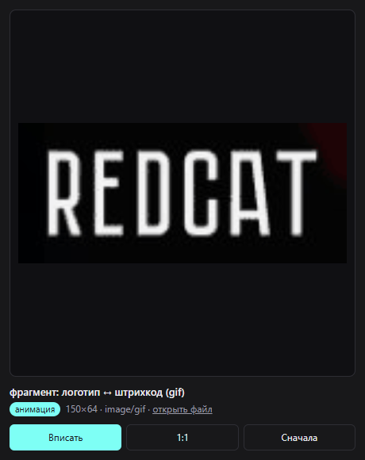

# GIF Preview — a Penpot plugin

Penpot's canvas renders an animated GIF as a still frame, so an animation you
imported looks frozen while you design. This plugin gives it back: select a shape
and its animated fill plays in the panel, at full size and at the right speed.



## What it does

- plays **GIF, animated WebP and APNG** image fills;
- follows the selection — pick another shape and the preview switches;
- **Fit / 1:1** view modes and a **Restart** button to replay from the first frame;
- shows the fill's format and pixel size, with a link to the original file;
- follows the Penpot light/dark theme; UI in English or Russian, by browser locale.

## How the image gets in

The plugin panel is an isolated iframe, and a browser only accepts a cross-origin
file there if the server marks it as embeddable. Penpot serves media without
`Cross-Origin-Resource-Policy` and without CORS headers, so the panel cannot take
the file directly — not as an image, not with `fetch`, and not from the plugin
sandbox either (its `fetch` returns a response without byte accessors, and there
is no `XMLHttpRequest`).

So the panel tries every direct route first, and once it sees they are closed it
switches to a mirror (`wsrv.nl`) that re-serves the file with the right headers
and keeps every frame. The media URL is already public — it needs no session —
but it does mean the file passes through a third party. If Penpot ever adds the
missing header, the direct route starts working again on its own.

## Install

Open the plugin manager (`Ctrl/⌘ + Alt + P`) and paste the manifest URL:

```
https://<your-user>.github.io/penpot-gif-preview/manifest.json
```

## Permissions

`content:read` only — the plugin reads the name and fills of the selected shape.
It never writes to your file.

## Development

Plain HTML and JS, no build step. Serve the folder over http and load
`http://localhost:<port>/manifest.json` in the plugin manager.

`test.js` is a Playwright check that runs the panel without Penpot: it fakes the
selection messages and serves a local GIF in place of the server response.

## License

MIT
